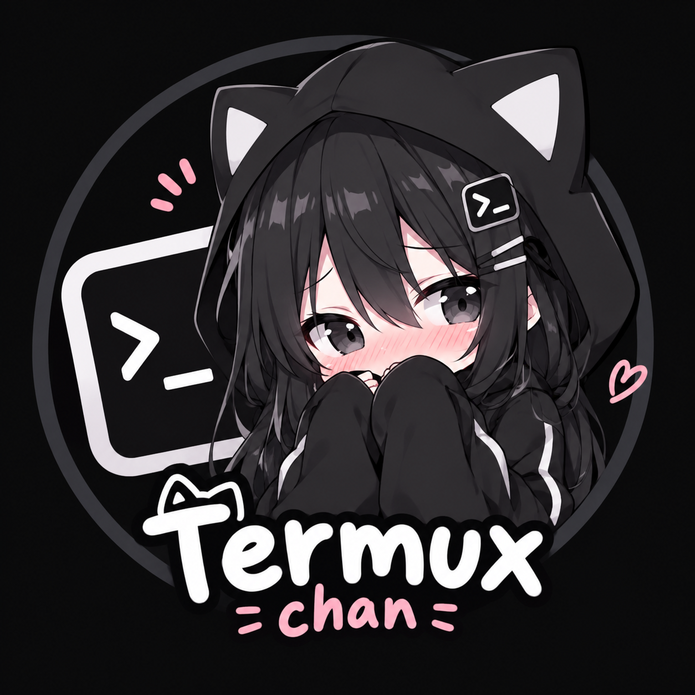

  
  <h1>Termux-chan</h1>
  
<i>A highly customized, modern terminal emulator for Android.</i>

**Termux-chan** adalah terminal emulator Android yang dimodifikasi secara khusus untuk mendukung grafis modern dan kustomisasi visual, ditenagai langsung oleh *engine* dari [Termux](https://termux.dev).

## ✨ Fitur & Teknologi (What's Inside)
- **🎨 Kitty Graphics Protocol** - Mendukung render gambar (Native Image Rendering) langsung di dalam terminal menggunakan format `\e_G`.
- **🌸 Fastfetch Anime Integration** - Otomatis menampilkan *anime artwork* resolusi tinggi yang terintegrasi dengan `fastfetch` saat terminal dibuka.
- **📋 Smart Image Paste** - Mendukung *copy-paste* gambar dari clipboard Android langsung ke dalam terminal (sangat berguna untuk AI CLI tools seperti Claude Code atau Aider).
- **🖼️ Live UI Customization** - Ganti wallpaper terminal dan atur tingkat transparansi (opacity) secara langsung tanpa perlu *restart* aplikasi.
- **🪟 Floating Window Ready** - Mendukung penuh mode *Freeform* dan *Split Screen* bawaan Android (Bisa jadi cendela mengambang).
- **🛡️ Independent Package** - Berjalan dengan `applicationId` mandiri (`com.termux.chan`), sehingga **tidak bentrok** dengan aplikasi Termux utama.

## 🚀 Powered By
- **Termux Engine** - Core terminal emulation, ANSI parsing, dan manajemen PTY (Pseudo-Terminal).
- **Android Canvas API** - Engine kustom untuk *rendering* wallpaper dan *opacity*.
- **Kitty Image Protocol** - Standar render gambar inline di CLI.

## 📜 Lisensi
Proyek ini menggunakan *engine* dari aplikasi Termux dan tetap tunduk pada [Lisensi GPLv3](LICENSE.md).
